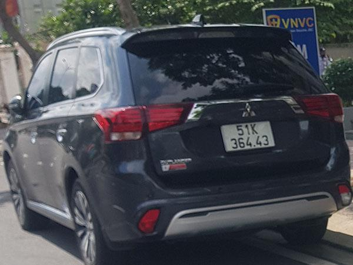

# Simple LPR-YOLOv8

A complete empirical License Plate Recognition (LPR) pipeline using **YOLOv8** for plate detection and **EasyOCR** for character recognition. Tailored for real-world usage in countries like **Vietnam**, this system supports custom training, inference, and easy deployment.

---

## 🚀 Features

- 📸 License Plate Detection using YOLOv8
- 🔤 OCR with EasyOCR for character recognition
- 🧠 Lightweight, fast, and accurate
- 🧪 Easy inference with visualization
- 🌍 Region-specific adaptability

---

## 📸 Demo

### 📷 Input Image



### 🧾 Output with OCR


---

## 📁 Folder Structure
```bash
├── runs/                  # YOLOv8 training outputs (ignored by .gitignore)
├── vn_license_plates/     # Vietnamese license plate dataset
├── inference.py           # Inference pipeline using trained model
├── train.py               # Training script with Ultralytics YOLOv8
├── lp_recognition.ipynb   # Notebook for simple training and inference
└── README.md
```
---

## 🛠️ Usage

### 1. Clone the Repo

```bash
git clone https://github.com/AresGod96/LPR-YOLOv8.git
cd LPR-YOLOv8
```
### 2. Install Dependencies
```bash
pip install ultralytics easyocr opencv-python
```

### 3. Prepare Dataset
You can prepare your own dataset or use the [Vietnam License Plate Segment Datasets](https://www.kaggle.com/datasets/duydieunguyen/licenseplates/data). Put them under the folder `vn_license_plates` in the following structure
```bash
├ vn_license_plates
├── images/
├── labels/
├── dataset.yaml
```
Note: the annotation should be in YOLO format.

### 4. Train
You can either use train script [`train.py`](./train.py)
```bash
python train.py
```
or [Ultralytics CLI](https://docs.ultralytics.com/modes/train/)
```bash
yolo task=detect mode=train data=./vn_license_plates/dataset.yaml model=yolov8m.pt imgsz=640 device='0,1' patience=20
```

### 5. Inference
Refer to [lp_recognition.ipynb](./lp_recognition.ipynb) for loading your trained model and inference visualization.

## 🙌 Acknowledgements
- [**Ultralytics YOLOv8**](https://github.com/ultralytics/ultralytics)
- [**EasyOCR**](https://github.com/JaidedAI/EasyOCR)
- [**Vietnam License Plate Segment Datasets**](https://www.kaggle.com/datasets/duydieunguyen/licenseplates/data)