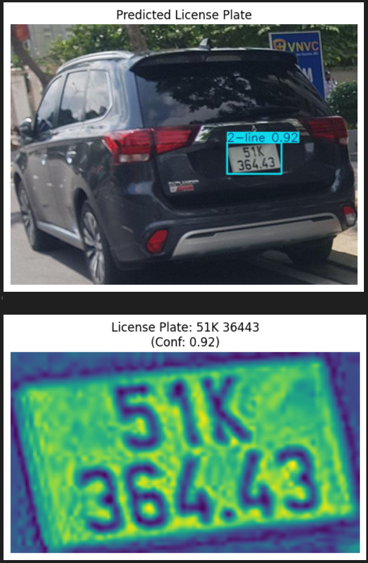

# LPR-YOLOv8

A complete License Plate Recognition (LPR) pipeline using **YOLOv8** for plate detection and **EasyOCR** for character recognition. Tailored for real-world usage in countries like **Vietnam**, this system supports custom training, inference, and easy deployment.

---

## 🚀 Features

- 📸 License Plate Detection using YOLOv8
- 🔤 OCR with EasyOCR for character recognition
- 🧠 Lightweight, fast, and accurate
- 🧪 Easy inference with visualization
- 🌍 Region-specific adaptability

---

## 📸 Demo

### 📷 Input Image


### 🧾 Output with OCR



---

## 📁 Folder Structure
```bash
├── datasets/              # Custom data config and annotations
├── runs/                  # YOLOv8 training outputs (ignored by .gitignore)
├── vn_license_plates/     # Vietnamese license plate samples
├── inference.py           # Inference pipeline using trained model
├── train.py               # Training script with Ultralytics YOLOv8
├── utils.py               # Utility functions for visualization & OCR
└── README.md
```
---

## 🛠️ Usage

### 1. Clone the Repo

```bash
git clone https://github.com/AresGod96/LPR-YOLOv8.git
cd LPR-YOLOv8
```
### 2. Install Dependencies
```bash
pip install ultralytics easyocr opencv-python
```